

  

  &nbsp;
  &nbsp;
  &nbsp;
  

 

<picture>
  <source media="(prefers-color-scheme: dark)" srcset="assets/title-01.svg" />
  
</picture>

I’m **Vishak**, an **Artificial Intelligence & Data Science** student focused on building practical AI systems and Python-based applications, and a **Python Developer** at Nexvra Solutions.

I like starting from a real problem and working toward something that runs, whether that is a regression model or an interview-practice app. I document what works, what is simulated and what is still planned. I’m most interested in machine learning, computer vision and intelligent applications, including **AI for the automotive space**.


 

<picture>
  <source media="(prefers-color-scheme: dark)" srcset="assets/title-02.svg" />
  
</picture>

<a href="https://github.com/vishak239/Prep-pitch"></a>

 

<picture>
  <source media="(prefers-color-scheme: dark)" srcset="assets/title-03.svg" />
  
</picture>

  <a href="https://github.com/vishak239/Prep-pitch"></a>
  
  <a href="https://github.com/vishak239/house-price-prediction"></a>
  <a href="https://github.com/vishak239/Multiple-Linear-regression-practices"></a>
  <a href="https://vishak-portfolio-gray.vercel.app"></a>
  <a href="https://github.com/vishak239/python-practice"></a>

  <b>Code</b> &nbsp;·&nbsp; <a href="https://github.com/vishak239/vishak-portfolio">portfolio source</a> &nbsp;·&nbsp; <a href="https://github.com/vishak239/python-practice">python-practice</a> &nbsp;·&nbsp; <a href="https://github.com/vishak239/numpy-practice">NumPy</a> &nbsp;·&nbsp; <a href="https://github.com/vishak239/Matplotlib_practices">Matplotlib</a> &nbsp;·&nbsp; <a href="https://github.com/vishak239/Seaborn_practices">Seaborn</a>

 

<picture>
  <source media="(prefers-color-scheme: dark)" srcset="assets/title-04.svg" />
  
</picture>

 

<picture>
  <source media="(prefers-color-scheme: dark)" srcset="assets/title-05.svg" />
  
</picture>

 

<picture>
  <source media="(prefers-color-scheme: dark)" srcset="assets/title-06.svg" />
  
</picture>


 

<picture>
  <source media="(prefers-color-scheme: dark)" srcset="assets/title-07.svg" />
  
</picture>


 

<picture>
  <source media="(prefers-color-scheme: dark)" srcset="assets/title-08.svg" />
  
</picture>


  <b>Interests</b> &nbsp;·&nbsp; artificial intelligence · machine learning · Python development · backend development · computer vision · data science · automotive AI · intelligent applications

 

<picture>
  <source media="(prefers-color-scheme: dark)" srcset="assets/title-09.svg" />
  
</picture>

  <a href="https://github.com/vishak239/Prep-pitch"></a>
  <a href="https://github.com/vishak239/vishak-portfolio"></a>
  <a href="https://github.com/vishak239/house-price-prediction"></a>
  <a href="https://github.com/vishak239/Multiple-Linear-regression-practices"></a>
  <a href="https://github.com/vishak239/python-practice"></a>
  <a href="https://github.com/vishak239/numpy-practice"></a>

Refreshed daily by <a href=".github/workflows/refresh-profile.yml">a GitHub Action</a>.

 

<picture>
  <source media="(prefers-color-scheme: dark)" srcset="assets/title-10.svg" />
  
</picture>


  

 

<picture>
  <source media="(prefers-color-scheme: dark)" srcset="assets/title-11.svg" />
  
</picture>

<a href="mailto:vishak3416@gmail.com"></a>

  &nbsp;
  &nbsp;
  

