  

  &nbsp;
  &nbsp;
  &nbsp;
  

 

<picture>
  <source media="(prefers-color-scheme: dark)" srcset="assets/title-01.svg" />
  
</picture>

I’m **Vishak**, a final-year **Artificial Intelligence & Data Science** student who builds practical AI systems and Python applications. I work as a **Python Developer** at Nexvra Solutions, and I’m growing toward AI engineering through machine learning, computer vision and backend development.

 

<picture>
  <source media="(prefers-color-scheme: dark)" srcset="assets/title-02.svg" />
  
</picture>

 

<picture>
  <source media="(prefers-color-scheme: dark)" srcset="assets/title-03.svg" />
  
</picture>

  
  
  
  
  
  

  <b>Foundations</b> &nbsp;·&nbsp; <a href="https://github.com/vishak239/numpy-practice">NumPy</a> &nbsp;·&nbsp; <a href="https://github.com/vishak239/Matplotlib_practices">Matplotlib</a> &nbsp;·&nbsp; <a href="https://github.com/vishak239/Seaborn_practices">Seaborn</a> &nbsp;·&nbsp; <a href="https://github.com/vishak239/python-practice">Python practice</a>

 

<picture>
  <source media="(prefers-color-scheme: dark)" srcset="assets/title-04.svg" />
  
</picture>

The Nexvra Solutions role was secured independently through my own job search.

 

<picture>
  <source media="(prefers-color-scheme: dark)" srcset="assets/title-05.svg" />
  
</picture>

 

<picture>
  <source media="(prefers-color-scheme: dark)" srcset="assets/title-06.svg" />
  
</picture>

 

<picture>
  <source media="(prefers-color-scheme: dark)" srcset="assets/title-07.svg" />
  
</picture>

  <b>Interests</b> &nbsp;·&nbsp; artificial intelligence · machine learning · Python · backend development · computer vision · automotive AI · data science · AI-powered applications

 

<picture>
  <source media="(prefers-color-scheme: dark)" srcset="assets/title-08.svg" />
  
</picture>

  

 

<picture>
  <source media="(prefers-color-scheme: dark)" srcset="assets/title-09.svg" />
  
</picture>

  &nbsp;
  

